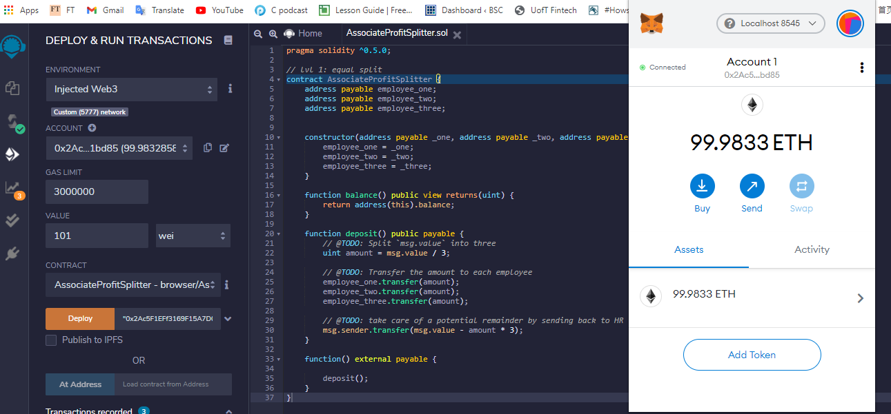
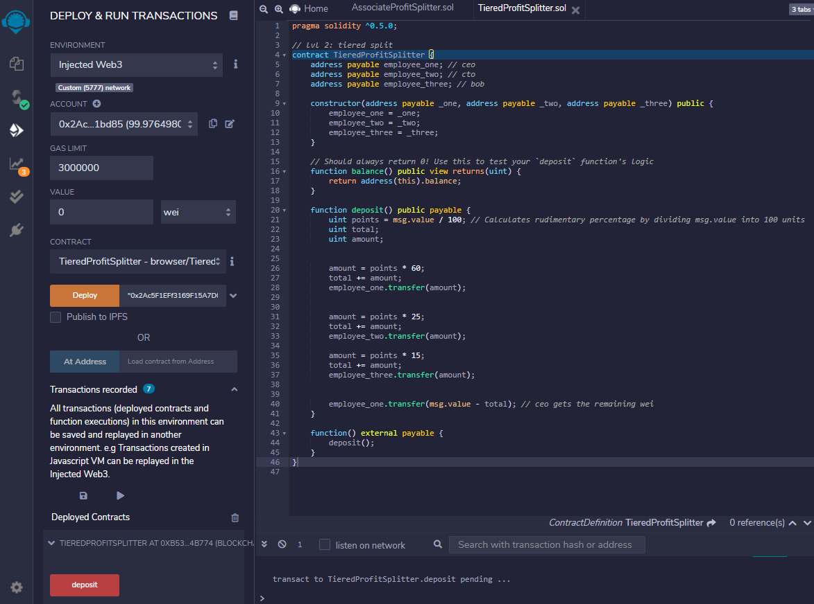
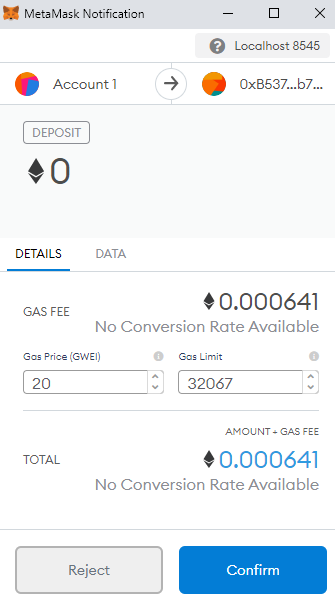
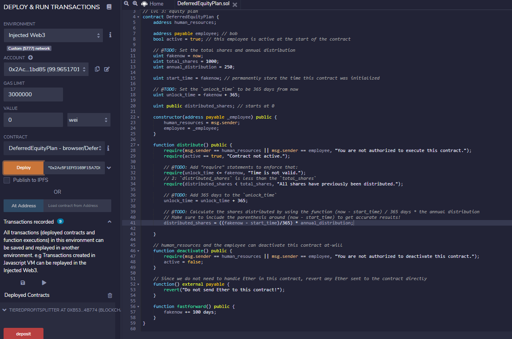
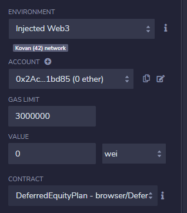
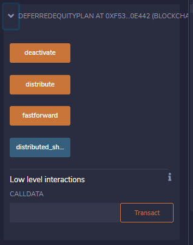

# Solidity-Smart-Contracts
Project Goal: Create several smart contracts with Solidity

## AssociateProfitSplitter

In this contract the three employees will receive the same amount. Any remainder (calculated as msg.value - amount * 3) will be sent back to Human Resources.

## TieredProfitSplitter

In this contract, we get closer to the paramaters demanded by real life, as the three employees now earn different amounts. Each employee will receive a different percentage of the total. We record the amount given to each employee and the disburse to Human Resources the difference between the recorded amount and the contracted value.

## DeferredEquityPlan

In this contract, employees and management agree to a deferred equity plan. In this plan employees receive 1000 company shares over a 4 year period. Each year the employee will receive 250 new shares (1000/4). 

